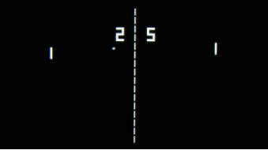

# Pong Game
A clone of the old arcade game "Pong", implemented in the C language and running in the computer terminal.

 

&nbsp;

## General information.

* Keys:

> A/Z and K/M - to move the rackets;

* Graphics:

> The field is a 80 x 25-symbol rectangle.

> Racket size is 3 symbols; 

> Ball size is 1 symbol.

* UI/UX

> When one of the players scores 5 points, congratulations to the winner are displayed on the screen and the game ends.

## History

&nbsp;

 

&nbsp;

>Pong, groundbreaking electronic game released in 1972 by the American game manufacturer Atari, Inc. One of the earliest video games, Pong became wildly popular and helped launch the video game industry. The original Pong consisted of two paddles that players used to volley a small ball back and forth across a screen.
>
>The German-born American television engineer Ralph Baer laid the groundwork for Pong in 1958 when he proposed making simple video games that people could play on their home television sets. The Magnavox Odyssey, known as the first console video game system, was released in 1972 and offered a game of table tennis, or Ping-Pong. Atari founder Nolan Bushnell created Pong, his version of this concept, as an arcade game. A small company at the time, Atari began manufacturing the games in an old roller skating rink, and by 1972 the company had sold more than 8,000 Pong arcade machines. In 1975 Atari turned Pong into a console system game. After striking an exclusive deal with Sears, Roebuck and Company, Pong was soon in the homes of many American families. Pong’s popularity declined in the 1980s as video games temporarily went out of style, but it had already secured its place in history as the most popular arcade game up to that time.
>
>In 1974 the makers of the Magnavox Odyssey sued Atari for stealing the concept for Pong. Magnavox won the lawsuit in 1977, upholding the company’s patent, but by then Atari had already licensed the patent for $700,000.
>
> Source: https://www.britannica.com/topic/Pong
>
&nbsp;

 
<i>created by Egor Oleynik in October 2021</i>

